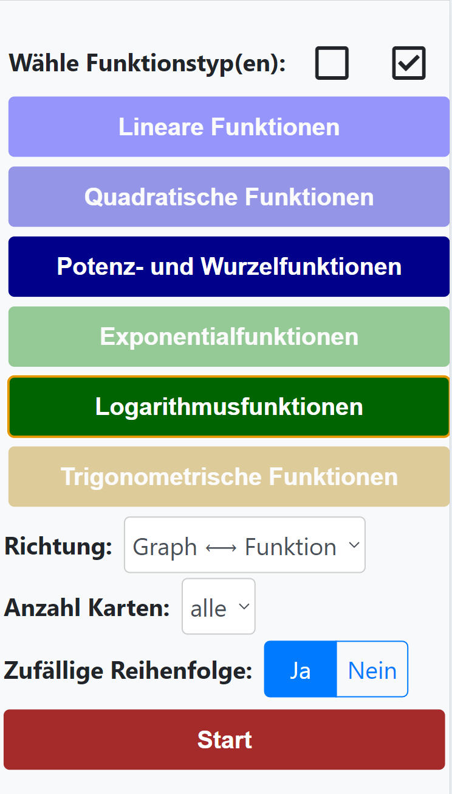

# Funktion und Graph

Code repository for a website with flashcards that shows the definition of a function on one side
and the graph of the same function on the other side of the flashcard.

See https://funktion-und-graph.ch/ for the online version.

The user can choose between different types of functions:

Example of the definition of function (one side of the flashcard):

Example of the graph of the same function (other side of the flashcard):

